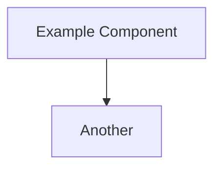

# 03 – Design Output

## 3.1 System Architecture ✏️ UPDATE

## 3.2 Key Design Requirements ✏️ UPDATE

| Category | Requirement |
|----------|-------------|
| Agents   | …           |
| Security | …           |
