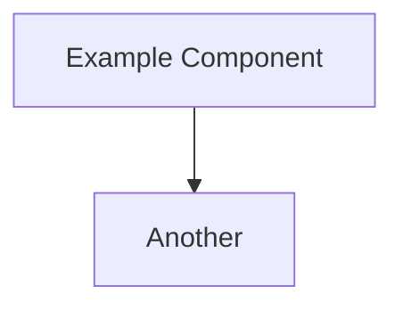

# Docs Folder Template

This file is copied verbatim into new projects.

## Purpose

Introduce vault & link to DHF notes.

🔒 KEEP

## How to use ✏️ UPDATE

- Rename Project Name below.
- Ensure [[definitions]] is linked to your project glossary if you maintain a separate one.

---

# Project Name Documentation ✏️ UPDATE

Welcome to the documentation vault for <Project Name>. Use the index below to navigate.

[[01 – Design Planning]]

[[02 – Design Input]]

[[03 – Design Output]]

[[04 – Design Verification]]

[[05 – Project Plan]]

---

# 01 – Design Planning

Sections tagged 🔒 KEEP remain unchanged; items tagged ✏️ UPDATE must be tailored to the project.

| Aspect         | Summary |
| -------------- | ------- |
| **Purpose** ✏️ UPDATE | One‑sentence mission of the project. |
| **Scope (MVP)** ✏️ UPDATE | Bullet list of major features included in first release. |
| **Tech Stack** ✏️ UPDATE | Stated technologies / frameworks. |
| **Stakeholders** ✏️ UPDATE | Roles & names responsible. |
| **Quality Plan** 🔒 KEEP | Continuous linters, unit tests, CI, UAT. |
| **Timeline** ✏️ UPDATE | e.g. 6 iterations (see [[05 – Project Plan]]). |

---

# 02 – Design Input

## 2.1 Primary Use Cases ✏️ UPDATE

Describe each user scenario in "As a … I want … so that …" form.

## 2.2 Functional Requirements ✏️ UPDATE

| ID    | Requirement |
|-------|-------------|
| FR‑01 | …           |
| FR‑02 | …           |

Each requirement line is ✏️ UPDATE. Table header is 🔒 KEEP.

---

# 03 – Design Output

## 3.1 System Architecture ✏️ UPDATE

## 3.2 Key Design Requirements ✏️ UPDATE

| Category | Requirement |
|----------|-------------|
| Agents   | …           |
| Security | …           |

---

# 04 – Design Verification

## 4.1 Verification Matrix ✏️ UPDATE

| Req ID | Test ID | Method | Acceptance Criteria |
|--------|---------|--------|--------------------|
| FR‑01  | T‑01    | Unit   | …                  |

## 4.2 Test Plans & Procedures 🔒 KEEP (outline)

- Unit Tests – automated per commit.
- Integration – run against mocks.
- UAT – staging environment walkthrough.

Add project‑specific details above ✏️ UPDATE.

---

# 05 – Project Plan

Iterations can be renamed; table layout 🔒 KEEP.

| Iteration   | Deliverables ✏️ UPDATE      | Duration ✏️ UPDATE |
|-------------|----------------------------|--------------------|
| 0 Kick‑off  | Charter, repo, CI scaffold | 1 w               |
| 1 …         | …                          | …                  |
